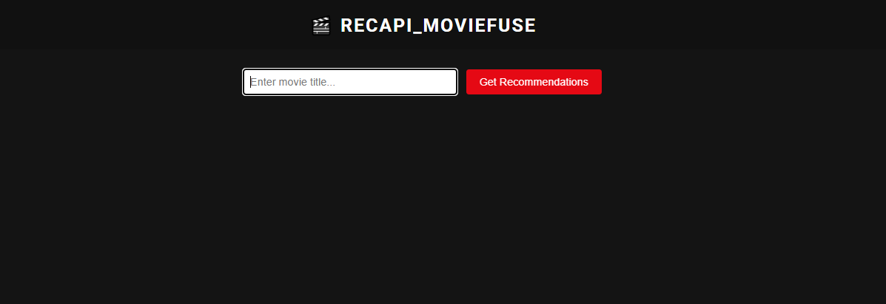
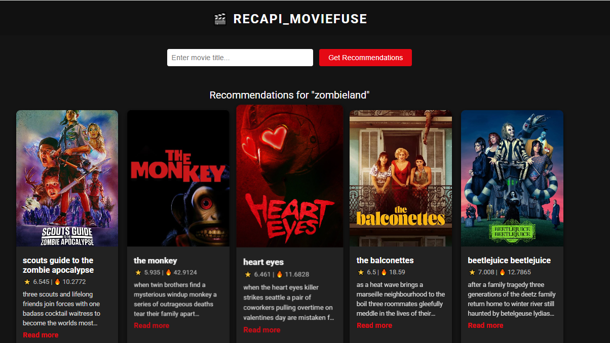

# 🎬🧠 RECAPI_MOVIEFUSE: A Hybrid Movie Recommendation System




## 🔍 Overview

**RECAPI_MOVIEFUSE** is a hybrid **Movie Recommendation System** that combines **content-based filtering** and **semantic similarity using Sentence Transformers** to deliver high-quality, relevant movie recommendations.

It is designed using **modular MLOps principles** for maintainability, scalability, and reproducibility:

- 🏗️ **Modular codebase** for ingestion, processing, and inference  
- ⚙️ **YAML-based configuration** for flexibility and cleaner tuning  
- 🧠 **Transformer-based embeddings** using Sentence-BERT  
- 🔄 **CI/CD pipeline** for automated testing and deployment  

### Key Features:

- API-driven data ingestion from IMDb-like datasets — supports dynamic updates and re-runs with fresh data
- Text preprocessing & vectorization using pretrained Sentence Transformers  
- Cosine similarity scoring for content-based matching  
- Configurable recommendation logic (genre prioritization, similarity weighting)  
- Streamlit-powered UI for seamless interaction  

---

## 🗃️ Dataset Overview

🔗 **Source**: Scraped or curated IMDb-style movie metadata (titles, genres, overviews)

### 📊 Key Columns:

- `movie_id`: Unique identifier  
- `title`: Movie title  
- `overview`: Plot summary  
- `genres`: Genre tags (Drama, Action, etc.)  
- `embedding`: SentenceTransformer vector representation  

> The dataset is preprocessed and cached for efficient embedding comparisons. Embedding generation is done once per batch using `all-MiniLM-L6-v2`.

---

## 🧪 How It Works

1. **Text Embedding**: Input movie overview is encoded using a pretrained SentenceTransformer model  
2. **Similarity Scoring**: Cosine similarity is computed between the input and all stored vectors  
3. **Ranking & Filtering**: Top-N most similar items are returned, with optional filters by genre/year  

> For deep dives into the embedding and scoring, see the notebook in `research/embeddings.ipynb`

---

## 📁 Project Structure
```
RECAPI_MOVIEFUSE/
│
├── .github/workflows/ # CI/CD config (GitHub Actions)
├── config/
│ ├── config.yaml # Paths, model choices, thresholds
│ └── params.yaml # Top-N, similarity cutoff, model params
├── data/
│ └── raw_movies.csv # Input movie dataset
├── research/
│ └── embeddings.ipynb # EDA and embedding experiments
├── src/recapi/
│ ├── component/
│ │ ├── ingestion.py
│ │ ├── preprocessing.py
│ │ └── recommender.py # Core recommendation logic
│ ├── utils/
│ │ └── vector_tools.py # Similarity, distance, and vector ops
│ ├── config/
│ └── pipeline/
│ └── main.py # Orchestration of full pipeline
├── app.py # Streamlit app
├── requirements.txt
└── setup.py


```
---

## ⚙️ YAML Configuration

- `config.yaml`: Directories, filenames, logging, embedding model path  
- `params.yaml`: Similarity thresholds, filtering rules, top-N output count  

> YAML configuration makes it easy to customize experiments without touching the logic.

---

## 🚀 CI/CD Pipeline

This project includes a **CI/CD-ready setup** with GitHub Actions:

- Installs dependencies  
- Runs tests  
- Executes core pipeline scripts  
- Saves recommendation artifacts for caching  

``` yaml
name: Recommender Pipeline

on: [push]

jobs:
  run:
    runs-on: ubuntu-latest
    steps:
      - uses: actions/checkout@v2

      - name: Set up Python
        uses: actions/setup-python@v2
        with:
          python-version: '3.10'

      - name: Install dependencies
        run: pip install -r requirements.txt

      - name: Run Recommender Pipeline
        run: python src/recapi/pipeline/main.py

```
```
🎯 Sample Results

| Query Movie   | Top Recommendation | Similarity Score |
| ------------- | ------------------ | ---------------- |
| Inception     | Interstellar       | 0.91             |
| The Matrix    | Equilibrium        | 0.88             |
| Titanic       | The Notebook       | 0.85             |
| The Godfather | Scarface           | 0.83             |
```

🛠️ How to Run
Clone the repo and install dependencies:

bash
Copy
Edit
pip install -r requirements.txt
Edit config.yaml and params.yaml as needed.

Then run the pipeline:

bash
Copy
Edit
python src/recapi/pipeline/main.py
Or launch the app:

bash
Copy
Edit
streamlit run app.py
✍️ Author
Developed by Mazen Asag
Open to contributions, issues, and enhancements!

yaml
Copy
Edit

